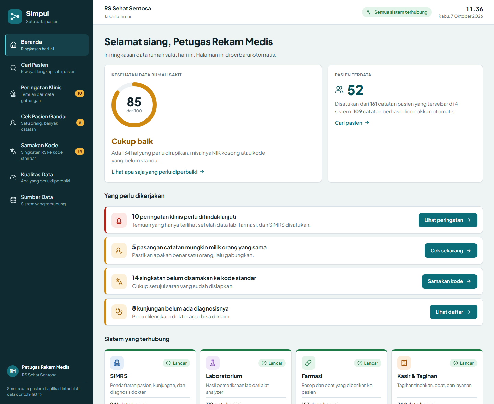
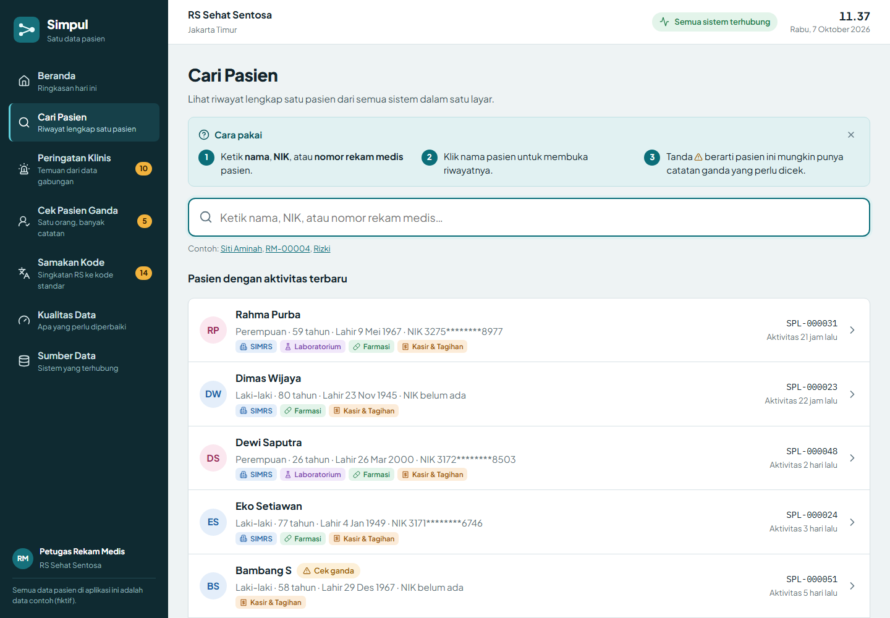
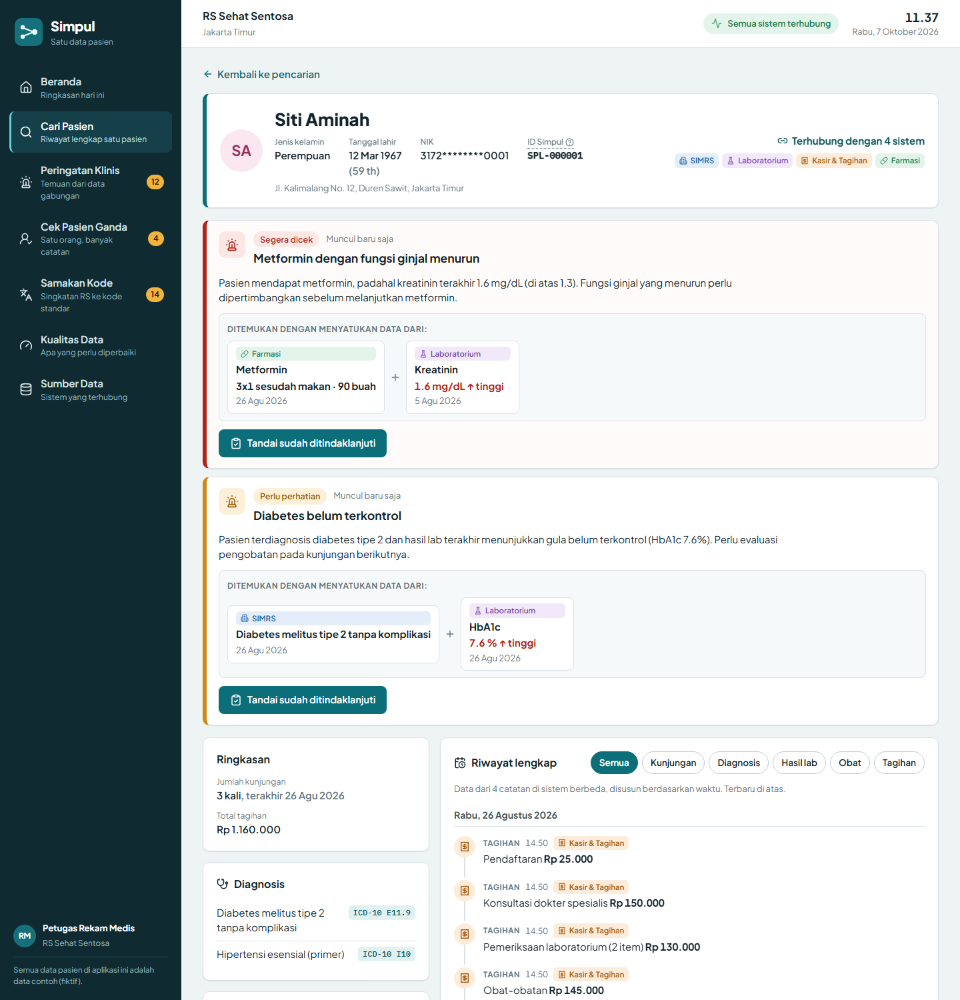
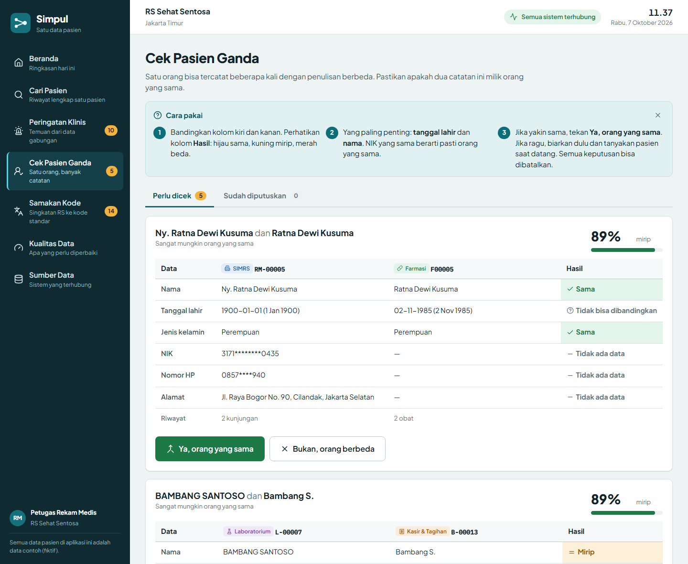
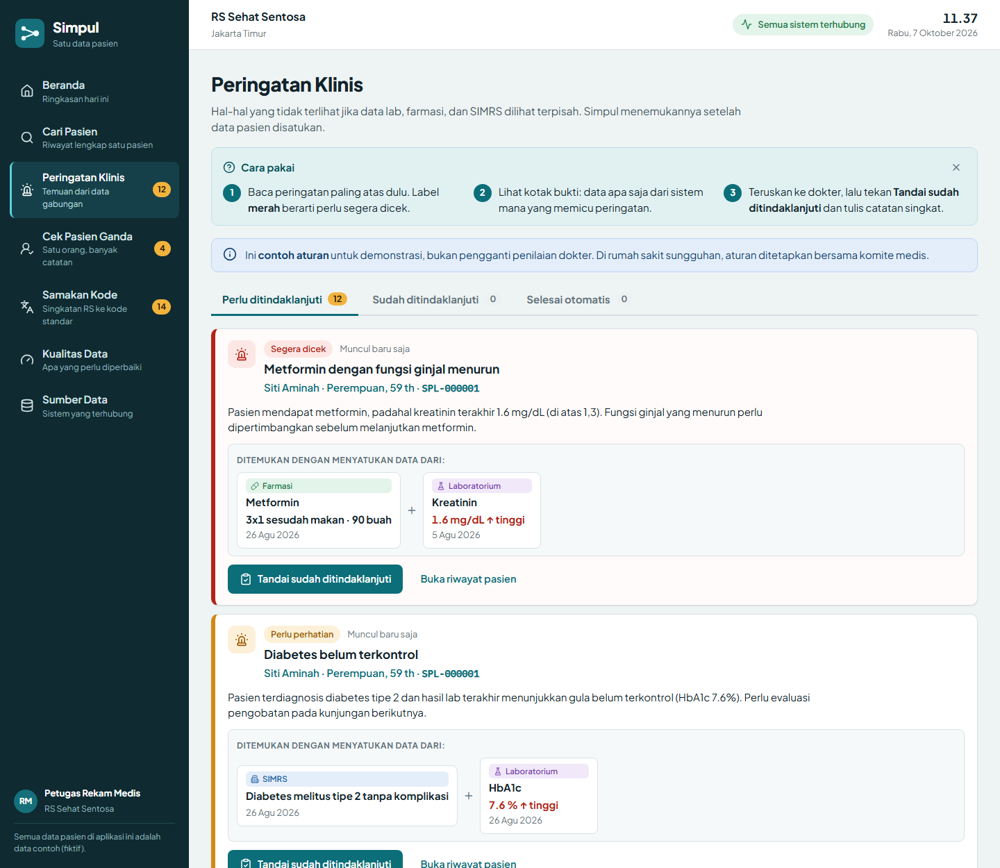
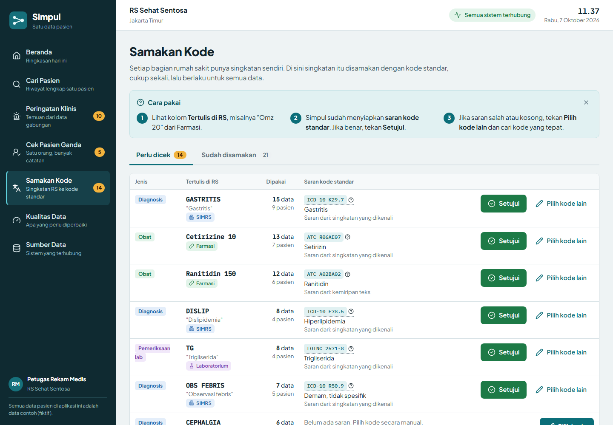
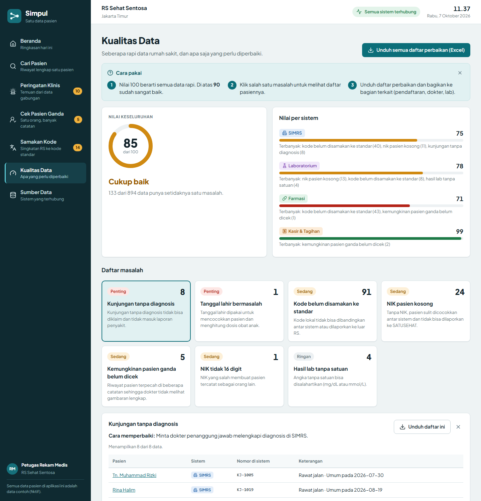
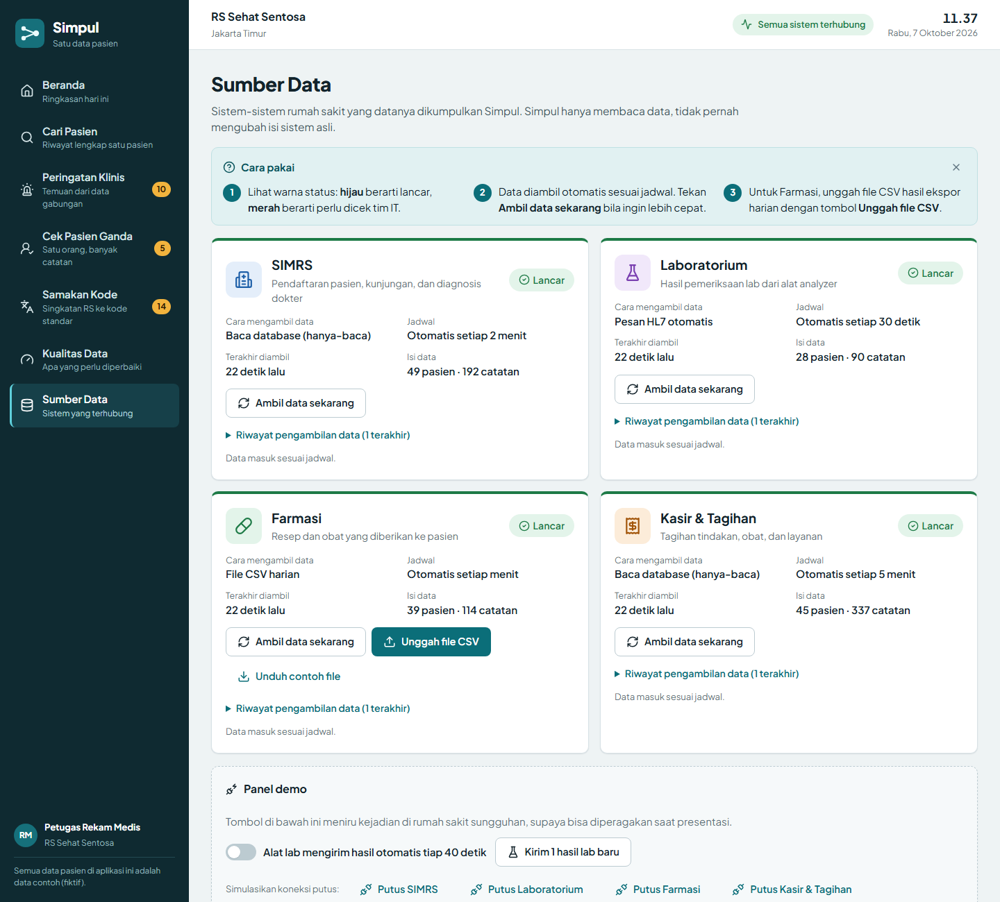
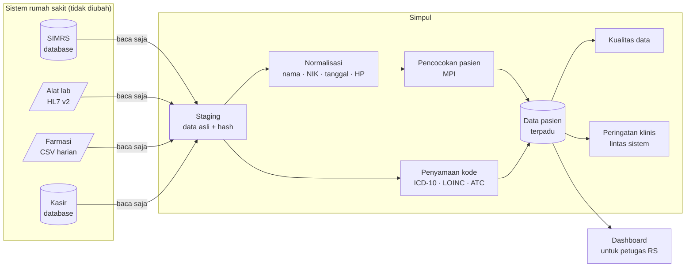

<div align="center">

# Simpul — Hospital Data Hub

**Satu pasien, satu riwayat. Dari semua sistem rumah sakit.**

Simpul mengumpulkan catatan pasien yang tercecer di pendaftaran, lab, apotek, dan kasir menjadi satu riwayat lengkap, supaya dokter tidak perlu membuka empat aplikasi untuk tahu pasiennya sakit apa.




</div>

---

## Daftar isi

- [Masalahnya](#masalahnya)
- [Apa yang dilakukan Simpul](#apa-yang-dilakukan-simpul)
- [Tur aplikasi](#tur-aplikasi)
- [Menjalankan dalam 1 menit](#menjalankan-dalam-1-menit)
- [Skenario demo 5 menit](#skenario-demo-5-menit)
- [Cara kerjanya](#cara-kerjanya)
- [Dirancang untuk pengguna awam](#dirancang-untuk-pengguna-awam)
- [Playbook implementasi di rumah sakit](#playbook-implementasi-di-rumah-sakit)
- [Dari demo ke produksi](#dari-demo-ke-produksi)

---

## Masalahnya

Rumah sakit di Indonesia rata-rata menjalankan **4–6 sistem dari vendor berbeda** yang tidak saling bicara.

| Sistem | Isinya | Cara datanya keluar |
|---|---|---|
| **SIMRS** | Pendaftaran, kunjungan, diagnosis | Database, sering tanpa API |
| **Laboratorium** | Hasil pemeriksaan | Pesan HL7 v2 dari alat analyzer |
| **Farmasi** | Resep dan obat | Ekspor CSV / Excel harian |
| **Kasir** | Tagihan | Database terpisah |

Akibatnya:

- **Satu orang tercatat sebagai beberapa pasien.** "Ny. Siti Aminah" di SIMRS, "AMINAH^SITI S." di lab, dengan tanggal lahir yang hari dan bulannya tertukar.
- **Setiap bagian punya singkatan sendiri.** "GDS", "Omz 20", "DISP" tidak bisa dibandingkan atau dilaporkan.
- **Hal penting tidak terlihat.** Apotek memberi metformin, lab mencatat kreatinin tinggi, tapi tidak ada yang melihat keduanya bersamaan.
- **Proyek digital macet di tahap data.** RME, SATUSEHAT, analitik, dan riset semuanya butuh data yang bersih dulu.

## Apa yang dilakukan Simpul

Simpul **duduk di samping** sistem yang sudah ada. Tidak menggantikan, dan tidak pernah menulis ke sistem asli.

| | Kemampuan | Hasilnya untuk RS |
|---|---|---|
| 🔌 | **Konektor hanya-baca** ke database, HL7, dan file CSV | Terhubung tanpa minta vendor mengubah apa pun |
| 🧑‍🤝‍🧑 | **Pencocokan pasien (MPI)** yang bisa dijelaskan | Satu ID untuk satu orang, petugas memutuskan kasus yang meragukan |
| 🔤 | **Penyamaan kode** ke ICD-10, LOINC, ATC | Data siap dilaporkan dan dibandingkan |
| 🚨 | **Peringatan klinis lintas sistem** | Temuan yang hanya muncul setelah data disatukan |
| 📊 | **Kualitas data** per sistem dan per aturan | Daftar perbaikan yang jelas untuk tiap bagian |
| 🩺 | **Pasien 360** | Riwayat lengkap dalam satu layar |

---

## Tur aplikasi

> Semua nama, NIK, nomor HP, dan rumah sakit di screenshot adalah **data sintetis**.

### 1. Beranda: "Apa yang perlu saya kerjakan hari ini?"


- **Nilai kesehatan data** 0–100 dengan keterangan dalam kata-kata ("Cukup baik").
- **Yang perlu dikerjakan**: setiap baris punya angka, penjelasan, dan satu tombol aksi.
- **Status 4 sistem**: ikon + kata + warna, diperbarui otomatis.

### 2. Cari Pasien



Cari dengan nama, NIK, nomor rekam medis, atau ID Simpul. Setiap pasien menunjukkan **dari sistem mana saja datanya berasal**, dan diberi tanda bila mungkin punya catatan ganda.

### 3. Pasien 360: satu riwayat dari empat sistem



- **Banner identitas** dengan dua penanda (nama + tanggal lahir/NIK), sesuai praktik keselamatan pasien.
- **Peringatan klinis** langsung di atas, lengkap dengan buktinya.
- **Ringkasan**: diagnosis dengan kode ICD-10, hasil lab terakhir dengan tanda tinggi/rendah, obat 3 bulan terakhir.
- **Riwayat lengkap** per tanggal. Setiap baris menunjukkan sistem asal, kode lokal, dan kode standarnya.
- **Catatan di tiap sistem**: nomor dan penulisan nama yang berbeda-beda, serta cara terhubungnya (otomatis atau oleh petugas).

### 4. Cek Pasien Ganda: manusia yang memutuskan



Dua catatan dibandingkan berdampingan. Kolom **Hasil** menunjukkan per data: *Sama*, *Mirip*, *Hari & bulan tertukar*, *Beda*, atau *Tidak ada data*. Dua tombol besar: **Ya, orang yang sama** atau **Bukan, orang berbeda**. Setiap keputusan bisa dibatalkan.

### 5. Peringatan Klinis: yang hanya terlihat setelah data disatukan



> *"Apotek dan lab tidak saling tahu. Simpul yang mempertemukan."*

- Setiap peringatan menunjukkan **bukti dari tiap sistem**, misalnya *[Farmasi] Metformin* **+** *[Lab] Kreatinin 1,6 ↑*.
- **Tandai sudah ditindaklanjuti**, dengan catatan. Siapa dan kapan tersimpan di database.
- Peringatan **selesai otomatis** bila kondisinya tidak berlaku lagi.
- Aturan bisa dinyalakan atau dimatikan sesuai kebijakan komite medis.

| Aturan | Data dari |
|---|---|
| Metformin dengan fungsi ginjal menurun | Farmasi + Lab |
| Trombosit sangat rendah tanpa tindak lanjut | Lab + SIMRS |
| Diabetes belum terkontrol | SIMRS + Lab |
| Kolesterol tinggi tanpa obat | Lab + Farmasi |

### 6. Samakan Kode



Singkatan RS ("Omz 20", "DISLIP", "TG") ditampilkan bersama **saran kode standar** dan berapa data yang memakainya. Cukup tekan **Setujui** sekali, dan langsung berlaku untuk semua data lama maupun baru. Arahkan kursor ke kode untuk penjelasan istilah (misalnya *"LOINC: kode standar internasional untuk jenis pemeriksaan laboratorium"*).

### 7. Kualitas Data



Nilai per sistem, kartu per masalah (apa, kenapa penting, cara memperbaiki), dan daftar pasien yang terdampak. Tombol **Unduh daftar perbaikan** menghasilkan file yang bisa dibuka di Excel dan dibagikan ke bagian terkait.

### 8. Sumber Data + Panel Demo



Status, jadwal, dan riwayat pengambilan data tiap sistem. Farmasi bisa **mengunggah CSV**. **Panel demo** bisa meniru kejadian di rumah sakit:
- alat lab mengirim hasil baru setiap 40 detik,
- memutus koneksi salah satu sistem,
- mengulang data dari awal.

---

## Menjalankan dalam 1 menit

Butuh **Python 3.11+** dan **Node.js 18+**.

**Windows:** klik dua kali **`start-demo.bat`**. Browser akan terbuka di http://localhost:8000.

**Manual (semua OS):**

```bash
# Backend
cd backend
python -m venv .venv
.venv\Scripts\activate            # macOS/Linux: source .venv/bin/activate
pip install -r requirements.txt

# Frontend (build sekali, disajikan oleh backend)
cd ../frontend
npm install
npm run build

# Jalankan
cd ../backend
python -m uvicorn app.main:app --port 8000
```

| Alamat | Isi |
|---|---|
| http://localhost:8000 | Aplikasi |
| http://localhost:8000/docs | Dokumentasi API (Swagger) |

- Data contoh dibuat otomatis saat pertama kali dijalankan.
- Untuk mengulang dari awal: **Sumber Data → Ulang data demo dari awal**, atau jalankan `python -m app.seed`.
- Untuk mengembangkan frontend: `npm run dev` di folder `frontend`, lalu buka http://localhost:5173.

---

## Skenario demo 5 menit

| # | Halaman | Lakukan | Yang dikatakan |
|---|---|---|---|
| 1 | **Beranda** | Tunjukkan 4 sistem hijau dan angka pasien | "Empat sistem dari vendor berbeda, terhubung tanpa mengubah sistem lama. 161 catatan disatukan menjadi 52 pasien." |
| 2 | **Cari Pasien → Siti Aminah** | Tunjukkan bagian *Hasil lab terakhir* yang kosong | "Ada tagihan lab, tapi hasil labnya tidak ada. Datanya tercecer." |
| 3 | **Cek Pasien Ganda** | Buka pasangan Siti. Lab mencatat tanggal lahirnya dengan hari dan bulan tertukar. Tekan **Ya, orang yang sama** | "Sistem tidak menggabung sembarangan. Kalau ragu, petugas yang memutuskan." |
| 4 | **Siti Aminah** lagi | Sekarang 4 sistem, dan muncul **2 peringatan klinis** | "Apotek memberi metformin, lab mencatat kreatinin tinggi. Tidak ada yang tahu, sampai datanya disatukan." |
| 5 | **Peringatan Klinis** | Tekan **Tandai sudah ditindaklanjuti**, isi catatan | "Tercatat siapa dan kapan. Bisa diaudit." |
| 6 | **Cek Pasien Ganda → Muhammad Rizki** | Nama dan tanggal lahir sama, alamat dan HP beda. Tekan **Bukan, orang berbeda** | "Nama sama belum tentu orang yang sama." |
| 7 | **Samakan Kode** | Setujui *Simva 20 → Simvastatin* | "3 peringatan kolesterol selesai otomatis, karena pasiennya ternyata sudah minum statin. Kode yang tidak standar membuat alarm palsu." |
| 8 | **Sumber Data → Panel demo** | Tekan **Putus Kasir & Tagihan** | "Status langsung merah di semua halaman, dengan pesan yang jelas untuk tim IT. Data lama tetap aman." |

Penutup: *"Di atas data yang bersih ini, produk apa pun bisa langsung jalan: analitik, riset klinis, pelaporan SATUSEHAT."*

---

## Cara kerjanya



**Pencocokan pasien yang bisa dijelaskan**, bukan kotak hitam:

| Sinyal | Bobot | Catatan |
|---|---|---|
| NIK valid | Penentu | Sama = pasti satu orang; beda = pasti orang berbeda |
| Tanggal lahir | 0.35 | Hari & bulan tertukar diberi nilai sebagian |
| Nama | 0.30 | Sapaan/gelar (Tn., Ny., Hj., dr.) dibuang |
| Nomor HP | 0.15 | +62 / 62 / 08 disamakan |
| Jenis kelamin | 0.10 | |
| Alamat | 0.10 | Jaktim → Jakarta Timur, dan seterusnya |

| Skor | Tindakan |
|---|---|
| ≥ 90% | Digabung otomatis, **hanya jika** tanggal lahir sama persis dan nama hampir identik |
| 70–89% | Masuk antrian **Cek Pasien Ganda** |
| < 70% | Dianggap orang berbeda |

Detail lengkap: [PROJECT_STRUCTURE.md](PROJECT_STRUCTURE.md).

---

## Dirancang untuk pengguna awam

Petugas rumah sakit bukan orang IT. Setiap keputusan desain mengikuti itu:

| Prinsip | Penerapan |
|---|---|
| Bahasa sehari-hari | "Cek Pasien Ganda", bukan "MPI Queue". "Samakan Kode", bukan "Terminology Mapping" |
| Setiap halaman menjelaskan dirinya | Kotak **Cara pakai** 3 langkah, bisa disembunyikan |
| Status tidak hanya warna | Selalu ikon + kata + warna, aman untuk buta warna |
| Tombol menyebut hasilnya | "Ya, orang yang sama", "Ambil data sekarang", "Setujui" |
| Tidak ada keputusan yang permanen | Gabung, tolak, setujui kode, tindak lanjut: semuanya bisa dibatalkan |
| Keselamatan pasien | Banner identitas dengan dua penanda; NIK dan HP selalu disamarkan |
| Istilah teknis dijelaskan | Tooltip pada ICD-10, LOINC, ATC, ID Simpul |
| Pesan error yang membantu | Menjelaskan apa yang terjadi dan apa yang harus dilakukan |

---

## Playbook implementasi di rumah sakit

| Minggu | Kegiatan | Hasil |
|---|---|---|
| 1 | Discovery: petakan sistem, temui vendor SIMRS, urus akses hanya-baca | Peta sistem dan akses |
| 2 | Pasang konektor, tarik data historis | Laporan kualitas data pertama |
| 3 | Tuning pencocokan pasien dan kamus kode bersama tim rekam medis | Data pasien terpadu yang tervalidasi |
| 4 | Sinkron otomatis berjalan, aturan peringatan disepakati komite medis, pelatihan | Sistem berjalan mandiri |

## Dari demo ke produksi

| Bagian | Di repo ini | Di rumah sakit |
|---|---|---|
| Database Simpul | SQLite | PostgreSQL |
| SIMRS / Kasir | Database tiruan, dibuka mode hanya-baca | Read-replica database vendor, akun hanya-baca |
| Laboratorium | File `.hl7` di folder inbox | MLLP listener langsung dari analyzer |
| Farmasi | Folder CSV + unggah | Folder bersama / SFTP |
| Pengguna | Satu peran | SSO RS, peran (rekam medis, IT, direksi), log audit |
| Peringatan klinis | 4 contoh aturan | Aturan yang ditetapkan komite medis |
| Deploy | `start-demo.bat` | Docker di server RS (on-premise) |

---

## Struktur project

```
backend/   FastAPI · konektor · MPI · penyamaan kode · kualitas data · peringatan klinis · simulator RS
frontend/  React + TypeScript · 7 halaman · tanpa library UI
docs/      screenshot
```

| Dokumen | Isi |
|---|---|
| [PROJECT_STRUCTURE.md](PROJECT_STRUCTURE.md) | Folder, alur data, model data, logika MPI, aturan, endpoint API |
| [PLAYGROUND_RULES.md](PLAYGROUND_RULES.md) | Aturan kerja di repo: data pasien, sistem RS, konvensi kode |

---

> **Catatan.** Semua data di repo ini adalah **data sintetis** yang dibuat oleh `backend/app/seed.py`. Nama, NIK, nomor HP, dan rumah sakit (*RS Sehat Sentosa*) adalah fiktif. Aturan peringatan klinis adalah **contoh untuk demonstrasi**, bukan pengganti penilaian dokter.
